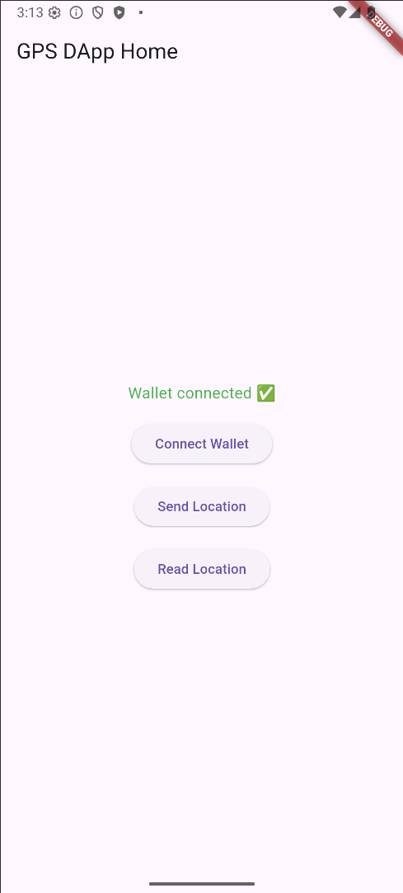
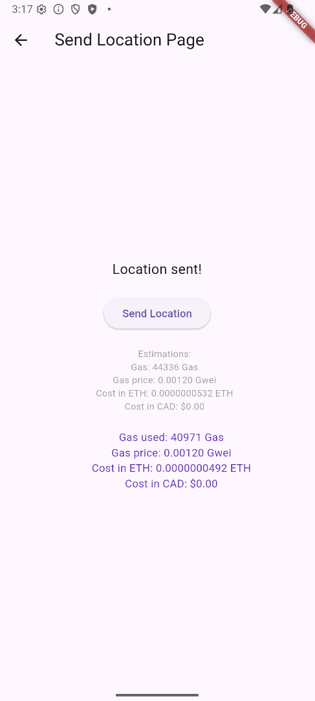
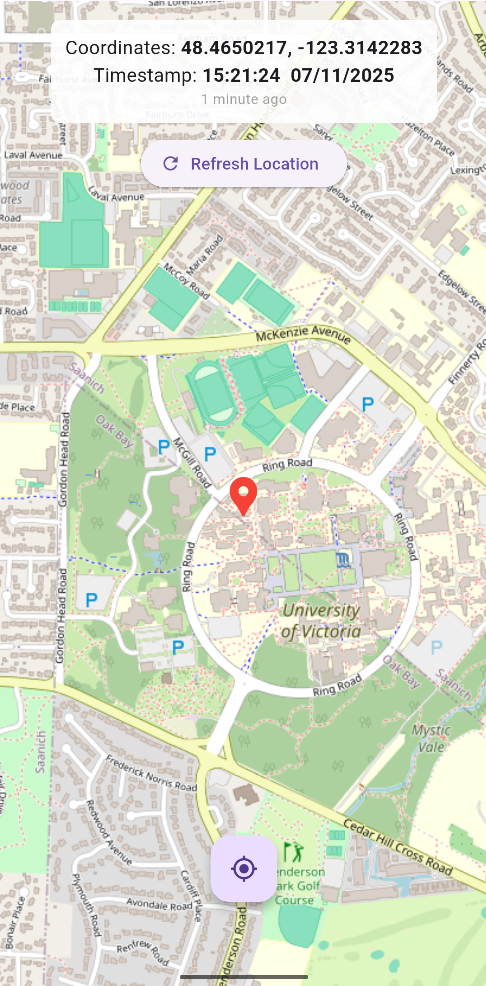

# Decentralized Location-Sharing App

A proof-of-concept mobile application for private, secure location sharing using the Ethereum blockchain (on the Sepolia Testnet).  
Developed with Flutter, featuring end-to-end encryption for user privacy.

## Features
- Decentralized location sharing using Ethereum blockchain (on Sepolia Testnet)
- AES encryption
- Secure key management
- Real-time map interface
- Cross-platform support (Android & iOS)

## Tools
- **Flutter/Dart**
- **Ethereum/Solidity**

## Screenshots

